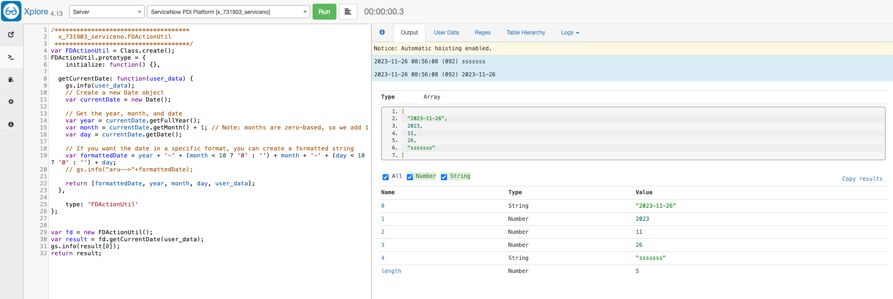

# servicenow-pdi-platform
This contains scripts and workflows for overall platform inside a scope application

### xplore toolkit
https://github.com/jneale/Xplore

1. Download update set from https://developer.servicenow.com/connect.do#!/share/contents/9650888_xplore_developer_toolkit?v=4.13&t=PRODUCT_DETAILS
* Go to retrieved update set in pdi instance
* Import from xml
* Preview and commit the update set
* Open xplore in navigation
* Screenshot for development hints

2. https://developer.servicenow.com/connect.do#!/share/contents/1148200_bettergetter?v=1.0&t=PRODUCT_DETAILS

3. https://developer.servicenow.com/connect.do#!/share/contents/3755104_servicenow_discovery_spoke?v=1&t=PRODUCT_DETAILS